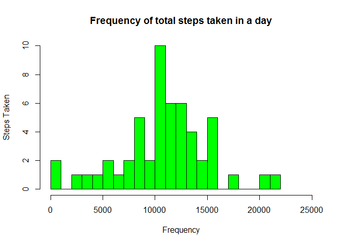
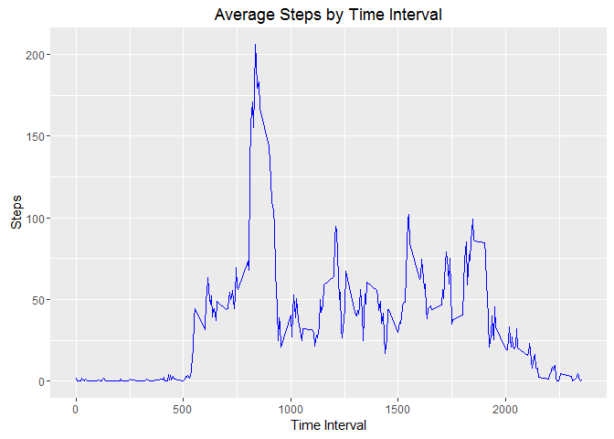
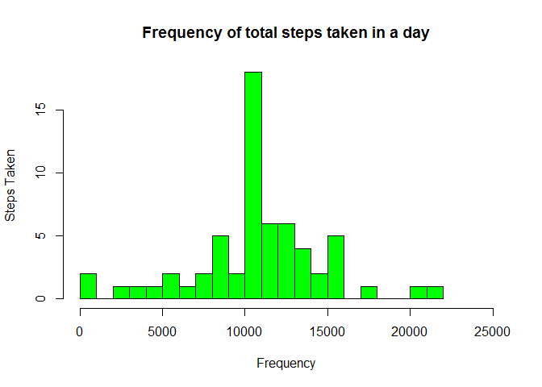
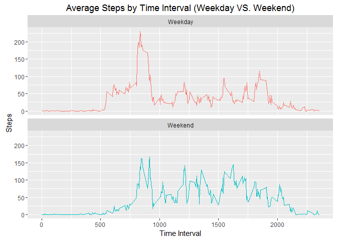

# Reproducible Research: Peer Assessment 1
Clint Lehman  
April 4, 2016  
##Introduction

It is now possible to collect a large amount of data about personal movement using activity monitoring devices such as a Fitbit, Nike Fuelband, or Jawbone Up. These type of devices are part of the "quantified self" movement - a group of enthusiasts who take measurements about themselves regularly to improve their health, to find patterns in their behavior, or because they are tech geeks. But these data remain under-utilized both because the raw data are hard to obtain and there is a lack of statistical methods and software for processing and interpreting the data.

This assignment makes use of data from a personal activity monitoring device. This device collects data at 5 minute intervals through out the day. The data consists of two months of data from an anonymous individual collected during the months of October and November, 2012 and include the number of steps taken in 5 minute intervals each day.

The data for this assignment can be downloaded from the course web site:

Dataset: Activity monitoring data [52K]

The variables included in this dataset are:

steps: Number of steps taking in a 5-minute interval (missing values are coded as NA)
date: The date on which the measurement was taken in YYYY-MM-DD format
interval: Identifier for the 5-minute interval in which measurement was taken
The dataset is stored in a comma-separated-value (CSV) file and there are a total of 17,568 observations in this dataset.

## Loading and preprocessing the data

First we will load and preprocess our data for analysis. This assumes that you have already downloaded the data set and your working directory is set:

```r
#Load Libraries
library(ggplot2)
library(dplyr)
```

```
## 
## Attaching package: 'dplyr'
```

```
## The following objects are masked from 'package:stats':
## 
##     filter, lag
```

```
## The following objects are masked from 'package:base':
## 
##     intersect, setdiff, setequal, union
```

```r
#Read in File
activity <- read.csv("activity.csv", header = TRUE)
```

## What is mean total number of steps taken per day?

First we will create a new data set with the total steps taken by day:

```r
#aggregate totals by date
tots.by.day <- aggregate(steps ~ date, activity, sum)
```
Then we will use that data set to create a histogram and then find the mean and median:

```r
##Create Histogram of Steps per date
hist(tots.by.day$steps, breaks = 25, main = "Frequency of total steps taken in a day", xlab="Frequency", ylab="Steps Taken", col = "green", xlim= c(0, 25000))
```



```r
##Mean and Median of steps by day
mean(tots.by.day$steps)
```

```
## [1] 10766.19
```

```r
median(tots.by.day$steps)
```

```
## [1] 10765
```

## What is the average daily activity pattern?

For this question we will again modify the original data set. First we will create a data set that has the average number of steps by interval across all days in the data set.

```r
avg.by.day <- aggregate(steps ~ interval, activity, mean)
```

Then we will create a time series plot to show this trend in the data and run a command to find out the max time interval for steps:

```r
#Create time series plot
ggplot(avg.by.day, aes(x=interval, y=steps)) + geom_line(color = "blue") + ggtitle("Average Steps by Time Interval") + labs(x="Time Interval", y="Steps")
```



```r
#determine max interval for steps
avg.by.day[which.max(avg.by.day$steps),1]
```

```
## [1] 835
```

## Imputing missing values

In order to fix our missing data we will first evaluate the number of missing values:

```r
#Count NA's in original data set
sum(is.na(activity$steps))
```

```
## [1] 2304
```

To fill in missing data we are going to populate missing values with the mean number of steps taken during that five minute interval, where the mean is taken across the other days.

```r
#Create imputed data set
activity.na.fix <- transform(activity, steps = ifelse(is.na(activity$steps), avg.by.day$steps[match(activity$interval, avg.by.day$interval)], activity$steps))

##Get totals by day of new dataset
tots.by.day.fix <- aggregate(steps ~ date, activity.na.fix, sum)
```

Now that we have created the new data set from the imputed data we will create a new histogram and find the new median and mean:

```r
#Make a histogram of the new data
hist(tots.by.day.fix$steps, breaks = 25, main = "Frequency of total steps taken in a day", xlab="Frequency", ylab="Steps Taken", col = "green", xlim= c(0, 25000))
```



```r
#Recalculate the mean and median with new data set
mean(tots.by.day.fix$steps)
```

```
## [1] 10766.19
```

```r
median(tots.by.day.fix$steps)
```

```
## [1] 10766.19
```
With the new imputed data we see the that the mean and median match since we used the average number of steps from the whole data set to fill in the missing values.

## Are there differences in activity patterns between weekdays and weekends?

To evaluate the weekdays vs weekends we need to first create a new part of the week variable on our original data set:

```r
## Add identifier for part of the week
activity.na.fix$part.of.week = as.factor(ifelse(is.element(weekdays(as.Date(activity.na.fix$date, format = "%Y-%m-%d")), c("Monday", "Tuesday", "Wednesday", "Thursday", "Friday")), "Weekday", "Weekend"))
```

Now the we have the new part of the week identifier we can create a new averaged data set grouped by interval and part of the week:

```r
## Create new average time interval by part of week data set
avg.by.day.pow <- aggregate(steps ~ interval + part.of.week, activity.na.fix, mean)
```

Now we will plot the results to evaluate the trends:

```r
##Plot the results
g <- ggplot(avg.by.day.pow, aes(x=interval, y=steps, color = part.of.week)) + 
	geom_line() + 
	facet_wrap(~part.of.week, ncol = 1, nrow=2) +
	ggtitle("Average Steps by Time Interval (Weekday VS. Weekend)") + 
	labs(x="Time Interval", y="Steps") +
	theme(legend.position = "none")
print(g)
```



In looking at out comparison we see that weekends seem to be consitently more active bu weekdays have a large spike around 9 am. 

##Thanks for reviewing my project. I hope you enjoyed my analysis.

